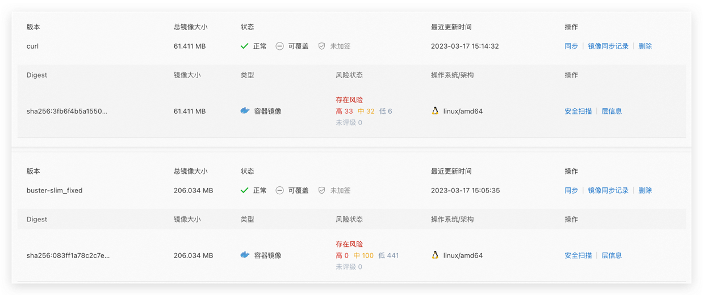
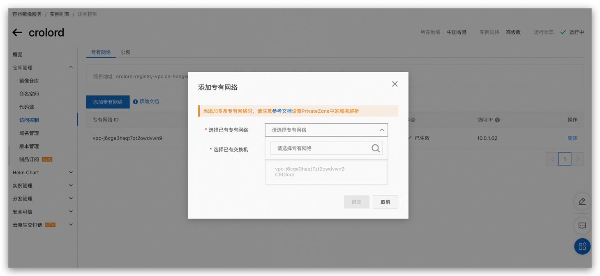

#### 什么是镜像安全

镜像安全是指在使用 Docker 或 Kubernetes 等容器技术时，确保使用的镜像是可信的、不含恶意软件和漏洞的。由于镜像中可能包含安全漏洞或恶意代码，如果使用不安全的镜像，则可能会导致容器被攻击或者数据泄露等安全问题。

镜像安全主要包括以下方面：

- 选择可信的镜像源：在使用 Docker 或 Kubernetes 时，可以从 Docker Hub 或其他可信的镜像源中下载镜像。确保选择的镜像源是可信的，镜像本身没有被篡改或污染。
- 使用最小化的镜像：使用最小化的镜像可以减少容器中存在的漏洞和攻击面。可以通过 Alpine 等轻量级 Linux 发行版来构建最小化的镜像。
- 定期更新镜像：定期更新镜像可以确保镜像中包含的软件和组件不含漏洞或已经得到修复。建议使用自动化工具来定期更新镜像。
- 镜像扫描和安全审计：使用镜像扫描和安全审计工具可以检测镜像中是否存在漏洞、恶意软件或其他安全问题。可以在镜像构建时或者部署时进行扫描和审计。
- 镜像签名和验证：镜像签名可以确保镜像的完整性和真实性，避免被篡改或替换。可以使用 Docker Content Trust 或其他签名工具来签名和验证镜像。

总之，镜像安全是容器安全的重要组成部分，需要在使用容器技术时重视和加以保障。

#### 选择阿里云容器镜像服务 ACR 的理由


| 云服务提供商                | 容器镜像仓库                         | 镜像扫描                              | 镜像签名     | 容器镜像加速器                           |
| --------------------------- | ------------------------------------ | ------------------------------------- | ------------ | ---------------------------------------- |
| Amazon Web Services (AWS)   | AWS Elastic Container Registry (ECR) | 支持 Amazon ECR Public 镜像的漏洞扫描 | 支持数字签名 | Amazon ECR Public                        |
| Microsoft Azure             | Azure Container Registry (ACR)       | Azure Security Center 容器安全扫描    | 支持数字签名 | Azure Container Registry Geo-replication |
| Google Cloud Platform (GCP) | Google Container Registry (GCR)      | 支持 Container Analysis 漏洞扫描      | 支持数字签名 | Google Container Registry                |
| Alibaba Cloud               | Container Registry                   | 支持容器镜像安全扫描                  | 支持数字签名 | 全球加速                                 |
| Tencent Cloud               | Tencent Hub                          | 支持镜像安全扫描                      | 支持数字签名 | Tencent Hub                              |
| IBM Cloud                   | IBM Cloud Container Registry         | 支持漏洞扫描                          | 支持数字签名 | IBM Cloud Container Registry             |
| Oracle Cloud Infrastructure | Oracle Cloud Infrastructure Registry | 支持镜像安全扫描                      | 支持数字签名 | Oracle Cloud Infrastructure Registry     |

需要注意的是，不同云服务提供商的具体功能和特点可能会随时更新和变化，以上表格仅供参考。
阿里云容器镜像服务（Container Registry）提供了完整的镜像管理和安全功能，包括以下方面：

镜像扫描：阿里云容器镜像服务提供了镜像安全扫描功能，可以检测镜像中是否存在漏洞、恶意软件或其他安全问题。用户可以在容器镜像服务控制台中开启安全扫描，并设置扫描的级别和频率。扫描结果会在控制台中展示，并提供详细的安全报告和修复建议。

镜像签名：阿里云容器镜像服务支持数字签名功能，用户可以对镜像进行签名，并验证签名的真实性。签名可以保证镜像的完整性和真实性，避免被篡改或替换。用户可以在控制台中设置镜像签名，并选择合适的签名方式。

镜像访问控制：阿里云容器镜像服务提供了细粒度的访问控制功能，用户可以设置镜像的访问权限和授权策略。可以授权指定用户或者组织访问镜像，也可以通过访问控制规则控制访问权限。这可以确保只有授权的用户可以访问镜像，避免未授权的访问和滥用。

安全报告和事件管理：阿里云容器镜像服务提供了安全报告和事件管理功能，可以在发现镜像安全问题时及时通知用户，并提供详细的修复建议和跟踪进度。用户可以在控制台中查看安全事件和修复进度，并及时采取相应的措施。

安全合规性：阿里云容器镜像服务支持多种安全合规性标准，如 CIS 基准、GDPR 等，用户可以在控制台中开启相应的合规性检测，并自动扫描和修复相关安全问题。这可以帮助用户满足安全合规性要求，保障数据和业务的安全。

#### 一个安全的镜像从签名开始

阿里云的容器镜像服务 ACR 可以对所有基于 Linux 的容器镜像进行安全扫描，自动识别镜像中的已知漏洞信息，并对漏洞信息进行评估和修复。这可以帮助用户更及时地发现并处理容器镜像中的安全问题，提高镜像的安全性。除此之外，ACR 还提供了支持私有仓库的功能，用户可以在安全的私有环境中存储和管理自己的容器镜像。同时，ACR 还提供了容器镜像的加速服务，可以提高容器镜像的下载速度，加速应用的部署。

1. 使用容器镜像服务 ACE 扫描镜像安全

#### 镜像扫描

1. 为了进行漏洞测试，给出了一个 Dockerfile 示例，但请注意，这个示例是有意制造漏洞的，请不要将其用于生产环境或其他重要的环境。

```dockerfile
FROM debian:buster-slim

RUN apt-get update && apt-get install -y \
    curl \
    wget \
    netcat \
    unzip \
    git \
    && rm -rf /var/lib/apt/lists/*

# 添加一个存在漏洞的服务，如 web 应用程序
RUN apt-get update && apt-get install -y apache2 && \
    sed -i 's/Listen 80/Listen 0.0.0.0:80/g' /etc/apache2/ports.conf

# 添加一个存在漏洞的 SSH 服务
RUN apt-get update && apt-get install -y openssh-server && \
    sed -i 's/PermitRootLogin prohibit-password/PermitRootLogin yes/g' /etc/ssh/sshd_config && \
    echo 'root:root' | chpasswd

# 安装一个存在漏洞的版本的 OpenSSL
RUN apt-get update && apt-get install -y openssl=1.1.1d-0+deb10u6

# 添加一个存在漏洞的数据库服务
RUN apt-get update && apt-get install -y mariadb-server && \
    sed -i 's/127.0.0.1/0.0.0.0/g' /etc/mysql/mariadb.conf.d/50-server.cnf && \
    echo '[mysqld]' >> /etc/mysql/mariadb.conf.d/50-server.cnf && \
    echo 'skip-name-resolve' >> /etc/mysql/mariadb.conf.d/50-server.cnf && \
    echo 'init_connect="SET NAMES utf8"' >> /etc/mysql/mariadb.conf.d/50-server.cnf && \
    echo 'character-set-server=utf8' >> /etc/mysql/mariadb.conf.d/50-server.cnf && \
    echo 'collation-server=utf8_general_ci' >> /etc/mysql/mariadb.conf.d/50-server.cnf && \
    /etc/init.d/mysql start && \
    mysql -u root -e "CREATE DATABASE testdb; GRANT ALL PRIVILEGES ON testdb.* TO 'testuser'@'%' IDENTIFIED BY 'testpassword'; FLUSH PRIVILEGES;"

# 开放容器内的端口
EXPOSE 80 22 3306

CMD ["/bin/bash"]

```

根据以上 dockerfile 示例我们可以上传到对应的 容器镜像服务ACR 仓库中，以下命令则提示内容

```shell
docker build . 
docker tag {images ID} {repo}/tag
docker push {repo}/tag
```

注意事项
1. docker 是否登录正确镜像仓库
2. 容器镜像服务ACR 版本是否企业版
预期效果


注意镜像修复依赖于包的发布者提供新的修复版本，如果包的发布者没有修复这个漏洞那么就无法修复。
2. 镜像扫描能力


| 特点          | 云安全                                 | Trivy                                  |
| ------------- | -------------------------------------- | -------------------------------------- |
| 开发商        | 阿里云                                 | Aqua Security                          |
| 扫描方式      | 基于云端                               | 基于本地                               |
| 镜像数量限制  | 无限制                                 | 无限制                                 |
| 扫描速度      | 中等                                   | 较快                                   |
| 检测类型      | 系统漏洞、应用漏洞、基线检查、恶意样本 | 系统漏洞、应用漏洞                     |
| 检测结果      | 包含 CVE、漏洞描述、修复建议等信息     | 包含漏洞描述、CVSS评分、影响版本等信息 |
| 修复能力      | 支持一键修复系统漏洞                   | 不支持                                 |
| 支持语言/框架 | 支持多种语言和框架                     | 主要支持Docker和OCI镜像                |
| 容器化        | 支持在阿里云容器服务、Kubernetes中使用 | 支持在Docker、Kubernetes中使用         |

    需要注意的是，Trivy 和云安全都只是容器镜像安全扫描的一种工具，不能完全保证镜像的安全。使用这些工具时，还需要注意镜像来源、使用最新的基础镜像、定期更新、使用最小化的镜像等安全最佳实践。
2. 镜像访问控制

1. 配置企业级 VPC 访问控制


上图示例中，显示为内网ACR VPC地址（crolord-registry-vpc.cn-hongkong.cr.aliyuncs.com）配置并将VPC内域名将解析至此IP。

    ACR企业高级版支持最多可以添加7条专有网络，此功能有助于区分 UAT、PRO、TEST 环境需求。公网不建议放开，特殊场景除外，当然您可以为公网环境配置白名单，适用于特定环境需要公网拉取、组织环境要求等。
3. 镜像签名

1. 